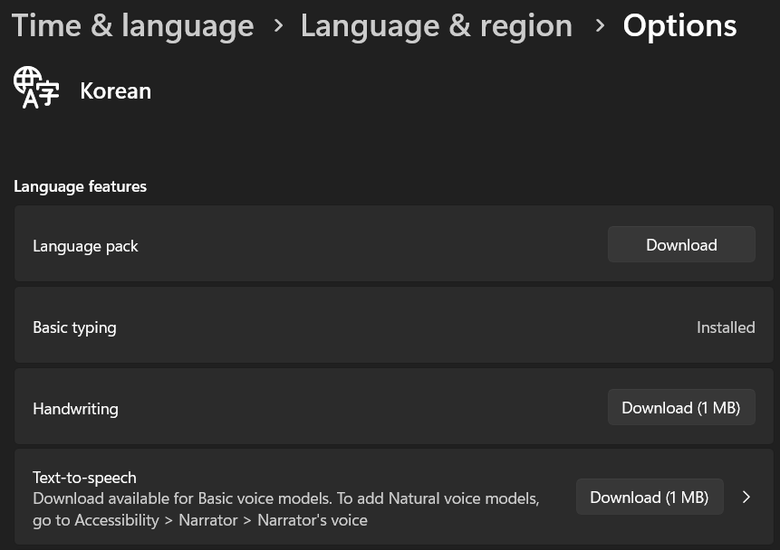

Had the issue of text-to-speech audio not playing, even though speaker icon was showing to indicate that something is being played.

Issue was that the voice pack on Windows was not installed.

Fixed by going into setting and adding it:

1. Open Settings → Time & Language → Language & region
2. Under "Preferred languages", click Add a language
3. Search for 한국어 (Korean) and click Next → Install
4. Once installed, click on Korean in the list → Language options
5. Under Speech, click Download to install the voice pack
6. Restart Firefox after the voice pack is installed

